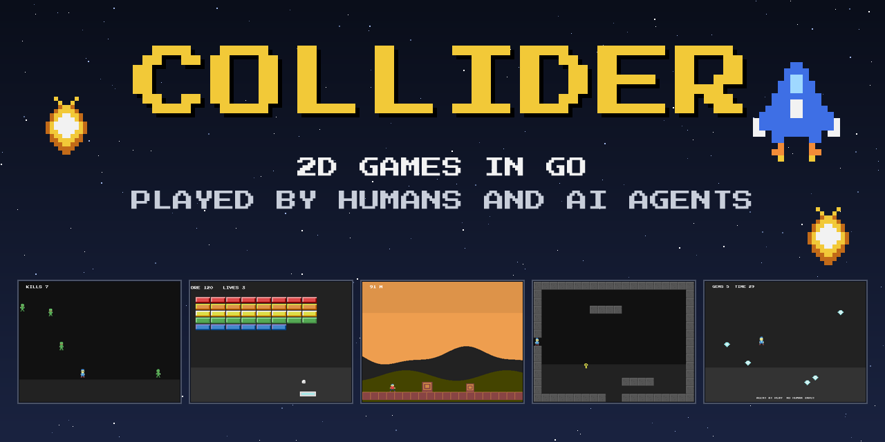
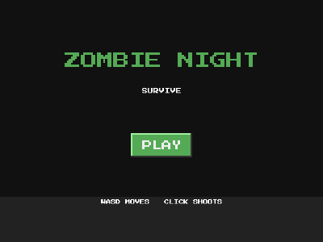

# Collider

**The fastest way to a playable 2D game in Go. Every game you build can be
played by humans and by AI agents, out of the box.**



Collider is a code-first 2D game engine built around one idea: games are made of
objects that collide, and things that happen when they do. You import the library,
describe your objects, attach events, and you have a game. No editor, no project
files, no boilerplate game loop.

```go
player.OnCollisionWith("enemy", func(e *engine.Object) {
    g.Sound("hit.wav")
    g.Go("gameover")
})
```

That covers the humans. For the agents, the very same binary you ship to
players is also a deterministic headless environment for bots and CI, and
an MCP server that any AI agent can connect to and play, with zero extra
code in your game:

```powershell
claude mcp add mygame -e COLLIDER_AGENT=mcp -- C:\path\to\mygame.exe
```



**What's in the box:**

- Collision-first core: enter-only collision events, tag rules, solid
  resolution, gravity, spatial hash broad phase
- **AI agents can play every game made with Collider**, out of the box:
  headless and deterministic for bots and CI, over MCP for any AI agent
  (Claude, Cursor, or a plain script), or on-screen via autopilot; one
  example game is played by its own agent and even records its demo GIF
  itself
- Scenes, timers, sprite-sheet animations, text with custom TTF fonts,
  sound and music (wav/ogg)
- Fifteen example games across genres, from pong to a dungeon crawler,
  each one a template you can start from
- Shipping built in: embed assets into a single .exe or build for the
  browser; one example is [live on itch.io](https://lucasantunesdealmeida.itch.io/ship)
- A GIF recorder for demos, and generated placeholder assets so nothing
  here needs hand-drawn art to run

---

## Design principles

1. **Fewest lines possible.** A complete game with menus, music, sprites and
   logic should fit in one small file. Every line of required boilerplate is a bug.
2. **Collisions are the core.** Clicks are point-vs-object collisions. Triggers,
   solid walls, bullets hitting enemies: one unified system with events.
3. **Sensible defaults.** Sprites collide with their image bounds. Sounds just
   play. Scenes just switch. Configuration is always optional.
4. **Scenes are everything.** A menu, a level and a game-over screen are all the
   same concept. Learn one thing, build every screen of your game with it.
5. **No magic.** Plain Go, plain callbacks, `go get` and read the code.

Built on top of [Ebitengine](https://ebitengine.org/) for windowing, rendering,
input and audio. Collider is the game-object, collision and event layer that
every Ebitengine project currently rebuilds by hand.

---

## Install

```bash
go get github.com/LucasAntunesdeAlmeida/collider
```

```go
import engine "github.com/LucasAntunesdeAlmeida/collider"
```

---

## Hello, collision

The smallest complete program: two objects, one event.

```bash
go run ./examples/hello
```

```go
package main

import (
	"fmt"

	engine "github.com/LucasAntunesdeAlmeida/collider"
)

func main() {
	g := engine.New("Hello, collision", 800, 600)
	play := g.Scene("play")

	box := play.Add(engine.Rect(64, 64, engine.Red).At(400, 300))
	player := play.Add(engine.Rect(48, 48, engine.Blue).At(100, 300))

	player.OnUpdate(func(dt float64) {
		if g.Key(engine.Right) {
			player.Move(200*dt, 0)
		}
		if g.Key(engine.Left) {
			player.Move(-200*dt, 0)
		}
	})

	player.OnCollision(func(other *engine.Object) {
		fmt.Println("hit!")
	})

	box.OnClick(func() {
		box.Destroy()
	})

	g.Run("play")
}
```

---

## Example games

Fifteen complete games, each exercising a different part of the engine
and each a starting point for your own. Run any of them from its own
folder so the asset paths resolve:

```bash
cd examples/pong
go run .
```

| Game | Genre | What it proves |
|------|-------|----------------|
| [Hello](examples/hello/) | Smallest program | Objects, movement, collision and click events |
| [Pong](examples/pong/) | Arcade / versus | Built-in velocity, solid bounce, score text |
| [Jumper](examples/jumper/) | Platformer | Gravity, solid ground, `Grounded()`, pickups |
| [Zombie Night](examples/zombie-night/) | Top-down shooter | Runtime spawning, tags, scene collision rules, timers |
| [Horde](examples/horde/) | Survivor | A world bigger than the window: camera follow, screen-fixed HUD, draw layers; drawing effects (flip, rotate, tint, flash, fade) |
| [Breakout](examples/breakout/) | Brick breaker | Grid spawning, win conditions, mouse control, menus |
| [Memory](examples/memory/) | Point-and-click puzzle | A game with zero movement, pure click events |
| [Arena](examples/arena/) | Survival | Extending the engine: your own types embedding `Object` with custom methods |
| [Caves](examples/caves/) | Exploration | Procedural generation: cellular automata map, BFS-guaranteed winnable |
| [Runner](examples/runner/) | Endless runner | Sprite sheet animations (run/jump/death), moving-world auto-scroll |
| [Dialog](examples/dialog/) | Visual novel | Custom TTF fonts, text size and color, typewriter effect |
| [Dungeon](examples/dungeon/) | Dungeon crawler | Multiple screens: ASCII room layouts, edge transitions, key and lock |
| [Catcher](examples/catcher/) | Arcade | Save system with plain encoding/json, no engine API needed |
| [Ship](examples/ship/) | Arcade | Publishing: embedded assets, fullscreen/resizable/icon, exe and browser builds |
| [Gem Rush](examples/agent/) | Arcade | Agents only: no human input; played by its own pilot, headless bots, or MCP agents |

Each example folder has the game's code, an explanation and a demo GIF.
The placeholder assets are generated by `go run ./tools/genassets`; replace
them with real art and the games look like games.

## AI agents can play your game

Any game you build with Collider is agent-playable out of the box, with
zero overhead until used. An agent sees the game as structured data, one
observation per step: the scene, and every object with its tag, position,
motion, size and text (so HUDs and scores are readable):

```json
{"scene": "play", "objects": [
  {"tag": "player", "x": 400, "y": 520, "w": 48, "h": 48},
  {"tag": "comet", "x": 312, "y": 180, "vy": 260, "w": 24, "h": 24},
  {"text": "SCORE 12", "x": 64, "y": 24, "w": 96, "h": 16}
], "state": {"lives": 2, "wave": 3}}
```

Positions are world coordinates; objects pinned to the screen with
`Fixed` (a HUD) report screen coordinates and carry `"fixed": true`.

Three optional calls make any game, however complex, fully
agent-playable and self-describing:

- `g.Controls(map[string]engine.Key{"jump": engine.Space, ...})` names
  your inputs; the MCP act tool accepts these names and lists them in
  its own description, so agents discover how to play on connect.
- `g.AgentState(func() any {...})` attaches game state (score, health,
  phase) to every observation as the `state` field above.
- `g.AgentDocs("...")` serves your game's rules to agents when they
  connect (the MCP initialize instructions).

Four ways in:

- **Headless** (bots, CI): `g.Headless("play")` then a loop of
  `g.Step(engine.Action{Keys: ...})`, each step returning the next
  observation. Deterministic: same actions, same results. Playtest your
  game with a bot on every commit.
- **MCP** (AI agents): run any Collider game with `COLLIDER_AGENT=mcp`
  and it serves MCP on stdio (`observe`, `act`, `reset` tools). Any MCP
  client can connect and play your game; `act` accepts any keyboard key
  by name, or the names you declared with `Controls`.
- **Windowed MCP** (fight the AI): `COLLIDER_AGENT=mcp-window` opens
  the normal window running in real time while serving the same MCP
  tools. Agent input merges with the keyboard, so a person and an
  agent can play the same game together, and COLLIDER_RECORD captures
  the match.
- **Autopilot** (watch it): `g.Autopilot(fn)` runs the game windowed
  while your agent function supplies the input each frame. Combine with
  the GIF recorder and an agent records your demo for you.

### Connect any MCP client in one command

The game itself is the MCP server (stdio): there is nothing to install.
With Claude:

```powershell
claude mcp add mygame -e COLLIDER_AGENT=mcp -- C:\path\to\mygame.exe
```

Cursor, Windsurf, VS Code and every other MCP client take the same
shape, a command plus one env var:

```json
{"mcpServers": {"mygame": {
  "command": "C:/path/to/mygame.exe",
  "env": {"COLLIDER_AGENT": "mcp"}
}}}
```

The protocol is plain newline-delimited JSON-RPC, so even a Python
script can drive a game through a subprocess.

Tag your player `"player"` so agents can find themselves. A game can opt
out entirely with `g.DisallowAgents()`. The
[Gem Rush example](examples/agent/) is a game with no human input at
all: its own pilot plays it, and its demo GIF is agent-recorded.

## Publish your game

Collider games ship as a single self-contained .exe (assets embedded via
`engine.UseAssets` and `go:embed`) or run in the browser via WebAssembly,
ready for itch.io. [PUBLISHING.md](PUBLISHING.md) is the complete guide;
the [ship example](examples/ship/) has it all wired up, and it is
actually published: **[play Ship in your browser on
itch.io](https://lucasantunesdealmeida.itch.io/ship)**.

## Record a GIF of your game

Every Collider game can record itself, no tooling needed. Set the
`COLLIDER_RECORD` environment variable to a file path, play, close the
window, and the session is saved as an animated GIF (the demos above were
made exactly this way):

```powershell
$env:COLLIDER_RECORD="demo.gif"; go run .
```

---

# API cheat sheet

The complete public surface implied by the example games. If it is not here, it
does not exist. That is the point.

### Game

| Call | Meaning |
|------|---------|
| `engine.New(title, w, h) *Game` | Create the game/window |
| `g.Scene(name) *Scene` | Create (or fetch) a scene |
| `g.Go(name)` | Switch scenes (state preserved) |
| `g.Restart(name)` | Switch scenes, resetting it to its initial state |
| `g.Run(name)` | Start the loop on a scene (blocks) |
| `g.Key(k) bool` | Is this key held? |
| `g.Mouse() (x, y)` | Cursor position (a finger on a touch screen counts) |
| `g.Sound(path)` | Fire-and-forget sound effect |
| `g.Quit()` | Exit |
| `g.Fullscreen(on)` / `g.Resizable(on)` / `g.Icon(path)` | Window polish |
| `g.Headless(scene)` / `g.Step(action)` / `g.Observe()` | Agent play, headless and deterministic |
| `g.Controls(map[string]Key)` | Name your inputs so agents can discover them |
| `g.AgentState(fn)` | Attach game state to every observation |
| `g.AgentDocs(text)` | Game rules served to agents on MCP connect |
| `g.DisallowAgents()` | Opt out of agent play (on by default) |

### Scene

| Call | Meaning |
|------|---------|
| `s.Add(obj) *Object` | Put an object in the scene (any time, even mid-game) |
| `s.Music(path)` | Looping background music while the scene is active |
| `s.Gravity(px_per_s2)` | Gravity for `WithGravity()` objects |
| `s.Every(sec, fn)` | Repeating timer |
| `s.After(sec, fn)` | One-shot timer |
| `s.OnClick(fn(x, y))` | Click anywhere in the scene |
| `s.OnUpdate(fn(dt))` | Runs every frame while the scene is active |
| `s.OnCollision(tagA, tagB, fn(a, b))` | Rule for every current and future pair |
| `s.Count(tag) int` | How many objects with this tag are alive |
| `s.Camera(x, y)` | Center the view on a world point (follow the player every frame) |

### Object: constructors and configuration (chainable)

| Call | Meaning |
|------|---------|
| `engine.Sprite(path)` | Object from an image (collider = image bounds) |
| `engine.Rect(w, h, color)` | Colored rectangle object |
| `engine.Text(str)` | Text object (clickable, but never collides) |
| `engine.UseAssets(fs)` | Load all assets from an embedded filesystem (go:embed) |
| `.At(x, y)` | Position (center); `.AtEdge()` picks a random screen edge |
| `.Tag(name)` | Label for tag-based collision rules |
| `.Solid()` | Engine resolves overlaps (walls, floors, paddles) |
| `.WithGravity()` | Affected by the scene's gravity |
| `.Visual()` | Decoration: drawn, never collides |
| `.Fixed()` | Pinned to the screen: ignores the camera, never collides (HUD) |
| `.Layer(n)` | Draw order: lower layers first, insertion order within a layer; clicks hit the top |
| `.Size(w, h)` | Override collider size |
| `.Animation(name, strip, frames, fps)` | Define a sprite-sheet animation |
| `.Font(path)` / `.TextSize(px)` / `.TextColor(c)` | Text styling (custom TTF, size, color) |

### Object: runtime

| Call | Meaning |
|------|---------|
| `o.X, o.Y, o.Vx, o.Vy` | Position and velocity; velocity applies every frame |
| `o.Data` | Free `any` field for your game state |
| `o.Move(dx, dy)` | Move (respects solid collisions) |
| `o.MoveToward(x, y, dist)` / `o.VelocityToward(x, y, speed)` | Homing helpers |
| `o.Grounded() bool` | Resting on a solid (platformers) |
| `o.SetText(s)` / `o.SetSprite(path)` | Change content at runtime |
| `o.Play(name)` / `o.PlayOnce(name)` | Switch animations (loop / hold last frame) |
| `.Alpha(a)` | Opacity, 0 (invisible) to 1 (opaque, the default): fades, ghosts |
| `.Tint(c)` | Multiply the colors by c (nil clears): color variants of one sprite |
| `o.Flash(c, sec)` | Draw a solid silhouette of color c for sec seconds (hit flash) |
| `.Rotate(rad)` | Draw turned around the center, clockwise; the collider stays upright |
| `.FlipX(on)` | Draw mirrored horizontally (face the way you walk); drawing only |
| `o.LifeTime(sec)` | Auto-destroy after n seconds |
| `o.Destroy()` | Remove from scene (safe inside callbacks; applied at end of frame) |
| `o.OnUpdate(fn(dt))` | Per-frame logic |
| `o.OnClick(fn)` | Clicked (point-vs-bounds collision) |
| `o.OnCollision(fn(other))` | Touching anything |
| `o.OnCollisionWith(tag, fn(other))` | Touching anything with this tag |

---

## Behavior you can rely on

1. **`Destroy()` is always safe**, including inside any callback: the object
   is removed at the end of the frame, never mid-iteration.
2. **Collision events fire on *enter*.** `OnCollision` fires once when contact
   begins, not on every frame of overlap. Continuous contact (standing on the
   floor) is one event.
3. **Solid vs trigger is the whole physics story.** `Solid()` objects push
   others out; everything else just reports contact. No forces, no torque,
   no restitution. If your game needs Angry Birds physics, this is not its
   engine.
4. **Text never collides.** A score label overlapping the ball will not
   bounce it. Text objects render and take clicks, nothing else.
5. **`Restart` rolls a scene back to its setup.** Objects added before the
   scene first runs are restored (even if destroyed); objects and timers
   spawned during play are dropped. Variables captured in your closures are
   yours to reset.
6. **A tap is a click.** `g.Mouse()` and every `OnClick` read touch as well
   as the mouse, so a game built for a mouse works on a phone without a
   second input path. A lifted finger leaves the cursor where it was, so
   anything following the cursor stays put until the next touch.

