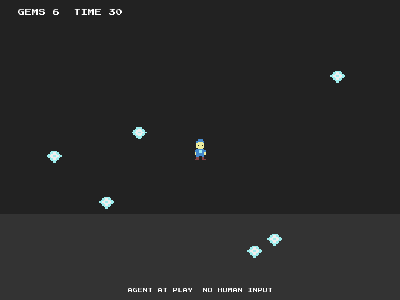

# Gem Rush (agents only)



Collect all six gems before the timer runs out. This game accepts **no
human input by design**: it exists to be played by agents, and the demo
GIF above was recorded by the game's own agent playing itself.

## Watch the agent play

```bash
cd examples/agent
go run .
```

A window opens and the built-in pilot plays, endlessly looping rounds.
It runs on `g.Autopilot(game.Decide)`: every frame the engine hands the
pilot an observation (tags, positions, HUD text) and receives an action
back. `Decide` chases the nearest gem using nothing an external agent
would not have.

## Headless (the CI shape)

```bash
cd examples/agent/bot
go run .
```

The same `Decide` pilot drives the game with no window at all through
`g.Headless("play")` and `g.Step(action)`, then prints how long the win
took (~4 game seconds). This is how you playtest games with bots in CI.

## External agents (MCP)

```powershell
$env:COLLIDER_AGENT="mcp"; go run .
```

The game becomes an MCP server on stdio with `observe`, `act` and
`reset` tools: connect any MCP client (Claude, for example) and it can
play the same game the built-in pilot does. Agent play is on by default
for every Collider game; games opt out with `g.DisallowAgents()`.
