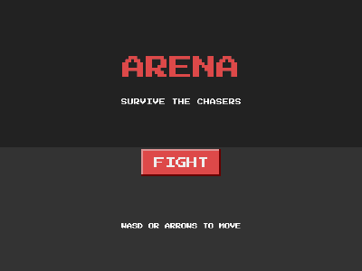

# Arena (survival, and the extension pattern)



Survive the chasers: WASD to move, three hit points, brief invulnerability
after each hit, knockback on contact. New chasers spawn every two seconds
from random screen edges, each with its own speed.

```bash
cd examples/arena
go run .
```

## What this example proves: extending Collider

This game's real subject is the `scripts/` folder. Collider is designed
to be built on, and the pattern is plain Go embedding:

```go
type Player struct {
    *engine.Object   // everything an object can do...
    HP int           // ...plus your own state
}

func (p *Player) TakeDamage(n int) { ... }   // ...and your own methods
```

- `scripts.Player` embeds `*engine.Object` and adds `HP`, `TakeDamage`
  (with an invulnerability window driven by `scene.After`), `Knockback`
  and `Reset`.
- `scripts.Chaser` embeds `*engine.Object` and adds a per-individual
  hunting speed.
- `main.go` stays a thin scene setup, reading like a script: spawn,
  wire collisions, switch scenes.

The embedded object IS the engine object (same pointer), so custom types
work everywhere the engine expects an object: collision callbacks, tags,
timers, `Restart` snapshots. Engine `Restart` restores object state
(position, velocity); game-level state like `HP` belongs to your type,
reset by your own method (`player.Reset()` here).

Folder convention proved here too: game code beyond `main.go` lives in
`scripts/`, assets (none needed for this one) in `sprites/` and `audios/`.
