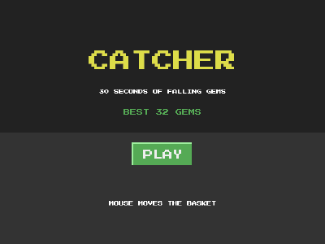

# Catcher (save system)



Catch falling gems with the paddle for 30 seconds. Your best score is
saved and greets you on the next run, on desktop and in the browser.

```bash
cd examples/catcher
go run .
```

The paddle follows the mouse.

## What this example proves: save data

```go
type saveData struct {
    Best int `json:"best"`
}

var state saveData
g.Load("save", &state)       // at startup; false on the first run
...
if err := g.Save("save", state); err != nil { // on a new record
    record.SetText("NEW BEST (NOT SAVED)")
}
```

- `g.Save(key, v)` stores any JSON-encodable value under a key;
  `g.Load(key, &v)` reads it back and reports whether it did. A missing
  key (the first run) or data that no longer decodes returns false and
  leaves `v` untouched, so defaults set before `Load` survive.
- **Why this is in the engine.** An earlier version of this example
  saved with `os.WriteFile` and claimed a save system needs no engine
  support. That holds on desktop only: a browser build (WebAssembly,
  see [PUBLISHING.md](../../PUBLISHING.md)) has no filesystem, so the
  same code silently forgot every record on itch.io. The engine now
  picks the storage for the platform: on desktop a file per key in the
  user's config directory (`%AppData%\Catcher\save.json` on Windows,
  `~/.config/Catcher/save.json` on Linux, `~/Library/Application
  Support/Catcher/save.json` on macOS), written atomically; in the
  browser, `localStorage` under `Catcher/save`.
- **Agents and tests never touch your saves.** Headless runs, MCP
  agents, Autopilot and `go test` keep saves in memory, so a bot
  playing a thousand rounds does not overwrite the player's best.

Design points worth copying:

- **Load once at startup, save at the moment that matters** (a new
  record), not every frame.
- **Extend `saveData` freely**: old saves keep loading, and fields they
  lack keep the values they had before `Load`. That is versioning for
  free.
- **First run is not an error**: `Load` just returns false.
- **Save when the window closes, too**: a player who closes the window
  mid-round (X, Alt+F4) would lose a record in the making. `g.OnClose`
  runs once, on the game loop, before the game ends:

  ```go
  g.OnClose(func() {
      if score > state.Best { // score is 0 outside a round
          state.Best = score
          g.Save("save", state)
      }
  })
  ```

  It never runs for `g.Quit()` (the game's own decision), headless, or
  in a browser, where the tab closes the page: there, save as you go.

To reset progress, delete the `Catcher` folder in your config
directory (or clear the site data in the browser).
