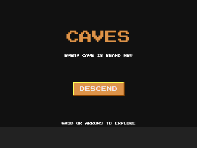

# Caves (procedural generation)



Explore a cave that never existed before you ran the game, and collect
every gem. Winning generates a brand new cave.

```bash
cd examples/caves
go run .
```

WASD or arrow keys to move.

## What this example proves

Procedural generation needs nothing from the engine; it is plain Go code
that ends in `scene.Add` calls:

- **Cellular automata** (`scripts/mapgen.go`): random fill, then four
  smoothing passes where crowded cells become wall and lonely walls
  erode. Classic cave shapes in ~40 lines, no engine types involved.
- **BFS flood fill** from the player's spawn: gems are placed only on
  reachable cells, so every generated cave is guaranteed winnable.
- **Wall merging**: horizontal runs of wall cells collapse into single
  solid rects, cutting hundreds of objects down to dozens with identical
  geometry.
- **Runtime rebuild**: the whole map is destroyed and regenerated
  between rounds with ordinary `Destroy` and `Add` calls, no special
  level-loading machinery.
