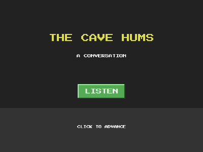

# Dialog (visual novel style, custom fonts)



A short conversation with a typewriter effect. Click to advance; clicking
mid-line reveals the rest instantly.

```bash
cd examples/dialog
go run .
```

## What this example proves

The text system with visual hierarchy:

```go
name := play.Add(engine.Text("").At(260, 430).
    Font("fonts/gobold.ttf").   // custom TTF, loaded by path and cached
    TextSize(30).               // larger than body text
    TextColor(engine.Yellow))   // colored speaker names
```

- **Custom fonts** load from a TTF/OTF file path; the default remains
  the embedded Go font, so simple games never need a font file.
- **`TextSize` and `TextColor`** give dialog its hierarchy: bold yellow
  names, plain white lines.
- **The typewriter effect is not an engine feature**: it is four lines
  in `OnUpdate` slicing the string by elapsed time, plus a click rule.
  Fewest lines, plain Go.
- `fonts/` joins `sprites/` and `audios/` in the example folder
  convention.
