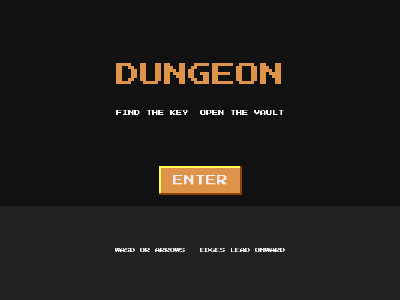

# Dungeon (multiple screens, key and lock)



Four connected rooms. Find the key, open the locked door, reach the
treasure. Walk off a screen edge to enter the neighboring room.

```bash
cd examples/dungeon
go run .
```

WASD or arrow keys to move.

## What this example proves

**Multiple screens without scene-per-room.** One scene rebuilds its
content on each transition; rooms are data, not scenes:

- **ASCII layouts** (`scripts/rooms.go`): each room is a slice of
  strings, `#` for walls, `K`/`D`/`T` for the key, door and treasure.
  Levels you can read and edit in any text editor, no level format or
  editor needed.
- **Edge transitions**: crossing the screen edge looks up the adjacent
  room in the world grid, repositions the player on the opposite side
  and rebuilds. About ten lines.
- **Persistent world state**: `hasKey` and `doorOpen` are plain Go
  variables. Collected keys stay collected and opened doors stay open
  when you walk back and forth, because the rebuild consults them.
- **Wall merging**: horizontal `#` runs collapse into single solid
  rects, same trick as the caves example.

Why not one engine scene per room? Scenes own their objects, so the
player would need to exist in every room scene. Rooms as data plus one
scene keeps a single player object and makes world state trivial.
