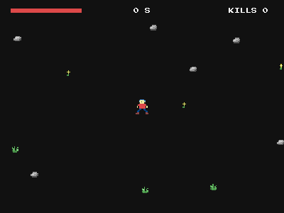

# Horde (a world bigger than the window)



Survive the night on a field far bigger than the screen. WASD or arrows
move the hero, who throws a dart every 0.3 seconds at the nearest
chaser (or the way they face, when none is in range); chasers pour in
from just beyond the edges of the view, wherever the hero goes, and
fall after three darts. Every moment a chaser touches the hero costs
health; when the bar runs out, the horde wins. Esc or P pauses, and
so does switching to another window. No keyboard? Press anywhere and
drag to steer. M mutes.

```bash
cd examples/horde
go run .
```

## What this example proves: the camera

```go
play.Camera(hero.X, hero.Y)                                  // follow the hero
play.Add(engine.Text("0 S").At(400, 30).Fixed())             // HUD pinned to the screen
play.Add(engine.Rect(800, 600, engine.Black).At(400, 300).Fixed()) // backdrop too
```

- `Scene.Camera(x, y)` centers the view on a world point. Every object
  keeps plain world coordinates (the field spans -2000..2000 here) and
  the engine shifts the drawing. Call it every frame to follow the
  player; ease toward the target for a smoothed camera.
- `Object.Fixed()` pins an object to the screen: position in screen
  pixels, drawn and clicked where it appears, never colliding. The
  clock and the ground color are fixed; the scenery and the chasers
  scroll.
- Clicks follow the camera too: world objects are hit where they
  appear, and `Scene.OnClick` receives world coordinates.

## Layers: draw order that survives spawning

Chasers spawn all night long, after the hero and the HUD exist. By
scene order alone they would draw over both. `Object.Layer(n)` fixes
the order once: scenery 0, chasers 1, darts 2, hero 3, HUD 4. Lower
layers draw first, objects on one layer keep the order they were added
in, and clicks go to whatever is drawn on top.

## Drawing effects: one sprite, many looks

```go
hero.FlipX(dx < 0)                                      // face the way you walk
play.Add(engine.Sprite("sprites/dart.png").Rotate(facing)) // point along the flight
chaser.Tint(engine.Orange)                              // a variant without new art
chaser.Flash(engine.White, 0.08)                        // the hit flash
chaser.Alpha(fade)                                      // fade out when fallen
```

- `FlipX(on)` mirrors the drawing: the hero's side-view sprite faces
  left or right with its movement, and chasers turn toward the hero.
- `Rotate(rad)` turns the drawing around the center: each dart is
  drawn along the direction it flies. Rotation and flip are drawing
  only; the collider stays the upright box.
- `Tint(c)` multiplies the colors: one green chaser sprite comes in
  three variants (untinted, yellow, orange).
- `o.Flash(c, sec)` draws a solid silhouette for a moment: a scene
  rule `OnCollision("chaser", "dart", ...)` flashes the chaser white,
  knocks it back and plays a hit sound. Three hits and it re-tags to
  `"fallen"`, so it no longer kills the hero, then `Alpha` fades it
  out over 0.3 seconds before it is destroyed.

## Area queries: aim and continuous contact

```go
if near := play.Near("chaser", hero.X, hero.Y, 450); len(near) > 0 {
	aim = math.Atan2(near[0].Y-hero.Y, near[0].X-hero.X) // nearest first
}
if len(hero.Touching("chaser")) > 0 { // every frame of contact
	hp--
}
```

- `Scene.Near(tag, x, y, r)` returns the live objects with a tag whose
  box overlaps a circle, closest center first. Each dart flies at
  `near[0]`, the nearest chaser within 450 pixels; with none in range
  it flies the way the hero faces. Visual objects count (a pickup
  magnet can pull decoration-only gems); Fixed HUD objects never do.
- `Object.Touching(tag)` returns what overlaps the object right now.
  Collision events fire once, on enter, so a chaser standing on the
  hero would hurt only once; `Touching` asks again every frame. Each
  hit costs one of five health points, shown by a Fixed bar on the HUD
  layer, then the hero blinks (`Alpha`) through half a second of
  invulnerability.
- Both run on a per-frame spatial grid the engine builds on the first
  query, so asking every frame, for every dart or enemy, stays cheap
  with hundreds of objects around.

## Hitbox: fair contact

```go
hero := play.Add(engine.Rect(42, 42, nil).Tag("player").Hitbox(24, 34))
c := play.Add(engine.Rect(36, 48, nil).Tag("chaser").Hitbox(22, 40))
```

A sprite's box is rarely its body: the hero's 42x42 frame has empty
corners and swinging arms, the chaser's arms reach out past its sides.
With the sprite bounds as colliders, a chaser brushing past the hero's
empty corner would cost health, which feels unfair. `Hitbox(w, h)`
sets the collision box apart from the drawn size, centered on the
object: collisions, `Touching`, `Near`, solids, and the `w`/`h` agents
observe all use it, while drawing (and view culling) keeps the full
sprite. Clicks also keep the drawn bounds, since players click what
they see. Without `Hitbox`, an object collides with its drawn size as
before. One object per creature does the job; no second invisible
collider to keep in sync.

## Overlay: a pause menu over a frozen night

```go
pause := g.Scene("pause")
pause.Add(engine.Rect(800, 600, engine.Black).At(400, 300).Alpha(0.6).Fixed())
pause.Add(engine.Button("RESUME").At(400, 320)).OnClick(g.CloseOverlay)
pause.Add(engine.Button("GIVE UP").At(400, 410)).OnClick(lose) // Go closes it too

play.OnUpdate(func(float64) {
	if pausePressed() { // Esc or P, on the press only
		g.Overlay("pause")
	}
})
```

- `g.Overlay("pause")` shows the pause scene on top of the night.
  The overlay runs normally (its buttons take the clicks), while the
  night keeps drawing underneath, frozen: no chaser moves, no dart
  flies, the clock and the spawn timers stop. `g.CloseOverlay()` picks
  up exactly where it froze.
- Both apply at the start of the next frame, like `g.Go`, so the press
  that opened the pause is never also seen by the pause scene on the
  same frame. `g.Go("over")` from GIVE UP closes the overlay on its
  own.
- The pause scene is an ordinary scene: it keeps its state between
  openings and does not touch the music.

**Edge detection.** `g.Key` answers "is it held?", and a press lasts
several frames. Toggling on "held" would open the pause, then close it
the very next frame because Esc is still down. The example remembers
the previous frame's state and acts only on the press:

```go
edge := func(keys ...engine.Key) func() bool {
	was := false
	return func() bool {
		down := false
		for _, k := range keys {
			down = down || g.Key(k)
		}
		hit := down && !was
		was = down
		return hit
	}
}
pausePressed, mutePressed := edge(engine.Esc, engine.P), edge(engine.M)
```

Both scenes call the same `pausePressed`, so the state carries across
the switch (only one of them updates each frame): holding Esc pauses
once, and the next press resumes.

## Held pointer: a virtual joystick

```go
if !g.MouseDown() { // button up, no finger on the glass
	held = false
	return 0, 0
}
mx, my := g.Mouse()
if !held { // just pressed: this point is the center
	held, sx, sy = true, mx, my
}
dx, dy = mx-sx, my-sy // steer toward the drag
```

- `g.MouseDown()` is true while the left button or any finger is held,
  so one path serves the mouse and a phone. Pressing anywhere sets the
  joystick's center; dragging steers the hero toward the pointer. An
  8-pixel dead zone ignores taps and shaky thumbs, and the knob stops
  at the ring's 48-pixel radius.
- The ring and the knob are two `Fixed` sprites on a layer above the
  HUD, shown with `Alpha` while the pointer is held and hidden
  (`Alpha(0)`) otherwise. The keyboard wins when both are in use.
- Agents drag too: an `Action` with `MouseDown: true`, or the MCP act
  tool's `down` flag, holds the pointer at `x`, `y`.

## Focus: pause when the player looks away

```go
if pressed() || !g.Focused() {
	g.Overlay("pause")
}
```

`g.Focused()` reports whether the window has the keyboard focus. When
the player alt-tabs away (or switches browser tabs), the night pauses
itself instead of killing them off screen, and stays paused until they
choose RESUME. Headless and agent play are always focused, so bots and
MCP agents never get paused by a window they do not have.

## Volume: a mute key

```go
if mutePressed() {
	muted = !muted
	if muted {
		g.Volume(0)
	} else {
		g.Volume(1)
	}
}
```

`g.Volume(v)` is the master volume, 0 (muted) to 1 (the default),
clamped. It changes the music that is already playing at once, and
every sound effect and track started afterwards, so one call mutes the
whole game. M toggles it in play and in the pause menu (the same
`edge` detector as the pause key), and a small `Fixed` "MUTED" label
on the HUD shows it is off. A settings slider would pass any value in
between.
