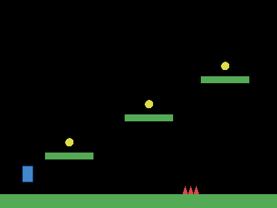

# Jumper (platformer)



The genre that demands collision *response*, not just detection. Solid objects
automatically push dynamic objects out (so you never sink through the floor),
`Grounded()` tells you when you can jump, and gravity is one line on the scene.

The full game is in [main.go](main.go). Run it from this folder so the
assets resolve:

```bash
cd examples/jumper
go run .
```

## What this example proves

- Notice what is absent: no jump physics code, no ground-check raycasts, no
  AABB resolution math. `Solid()` plus `WithGravity()` plus `Grounded()` cover
  the platformer contract.
- Tags (`coin`, `spike`) driving different collision reactions
- `Count` for the win condition
- Scene flow with `Go` and `Restart`, plus per-scene `Music`
