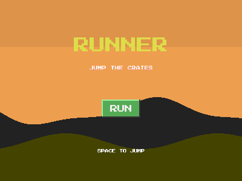

# Runner (endless runner, sprite animations)



The player runs automatically; Space is the only input. Jump the crates,
survive as far as you can. Distance is your score.

```bash
cd examples/runner
go run .
```

## What this example proves

**Sprite sheet animation.** The player defines three animations from
horizontal strips and switches between them:

```go
player := play.Add(engine.Rect(32, 48, engine.Blue).At(150, 480).WithGravity().
    Animation("run", "sprites/run.png", 4, 10).   // 4 frames, 10 fps, loops
    Animation("jump", "sprites/jump.png", 2, 6).
    Animation("death", "sprites/death.png", 4, 8))

player.Play("run")        // loops; calling it every frame is fine
player.PlayOnce("death")  // plays once, holds the last frame
```

The run/jump switch is one line in `OnUpdate` driven by `Grounded()`,
and death is a `PlayOnce` so the body stays down.

**Auto-scrolling needs no camera.** The screen appears to scroll because
the world moves: crates spawn off the right edge with `Vx = -300` while
the player's x never changes. The classic moving-world trick, and it
works with zero engine support.
