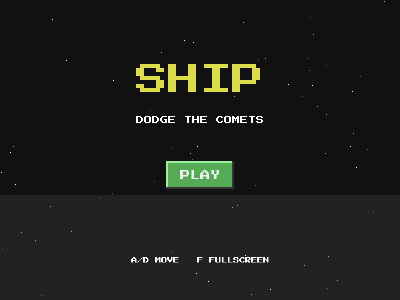

# Ship (built to be published, and it is)



**[Play it in your browser on itch.io](https://lucasantunesdealmeida.itch.io/ship)**:
this exact code, built to WebAssembly and uploaded per the guide.

A small dodge game whose point is the shipping pipeline: assets are
embedded in the binary, the window is resizable, F toggles fullscreen,
and [PUBLISHING.md](../../PUBLISHING.md) uses this example for the
single-exe and browser builds.

A/D or arrow keys to dodge the comets. Survive as long as you can.

```bash
cd examples/ship
go run .
```

## Ship it

```powershell
# One self-contained exe, no console window:
go build -ldflags "-s -w -H=windowsgui" -o ship.exe .

# Browser build for itch.io:
$env:GOOS="js"; $env:GOARCH="wasm"
go build -o web/game.wasm .
$env:GOOS=$null; $env:GOARCH=$null
```

See [PUBLISHING.md](../../PUBLISHING.md) for the index.html, the itch.io
upload flow, and generating THIRD-PARTY-NOTICES.txt.

## What this example proves

- `engine.UseAssets(content)` with `//go:embed sprites audios`: the
  same asset paths work from disk in development and from inside the
  binary when shipped.
- `g.Resizable(true)`, `g.Fullscreen(bool)` toggled from a key, and
  `g.Icon(...)` for the title bar.
- The whole publishing story is this file plus two build commands.
